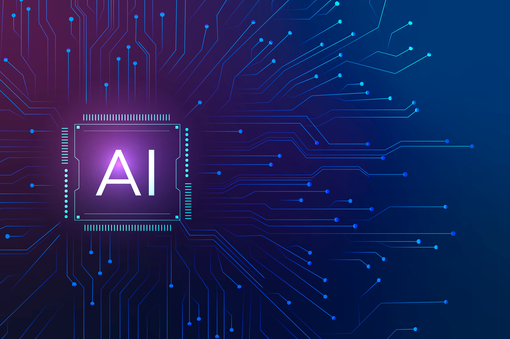

  <picture>
    
  </picture>

<h1 align="center">Ashikur Rahman</h1>

<strong>Software Engineer | Machine Learning Engineer</strong>

  

  
  
  

## About

Full-Stack Developer with 4+ years of experience delivering production-ready applications. Currently focused on Machine Learning Engineering, building scalable and data-driven intelligent systems.

---

## At a Glance

- ⭐ **Highlights:** `SaaS/AI` (4+ yrs) · `Full-stack` (React/Next/Django· Node/FastAPI). `Database` (Postgres/Mongo/MySql).
- 🎯 **Current Focus:** `ML model development` · `Data preprocessing & EDA` · `Feature engineering` · `Predictive modeling` · `ML pipeline automation` · `Model evaluation & optimization` · `Deploying ML-powered applications`.

---

## Toolbox

**Languages & Core**

 
**Frontend** 

**Backend & APIs**

**Data Science & Machine Learning**

**Database**

**Cloud & DevOps**

**Automation & Tooling**
- Postman, CI/CD
- Design/Collab: Figma, VS Code, JetBrains, jupyter, google Colab

---

## GitHub Activity

  

  

---
